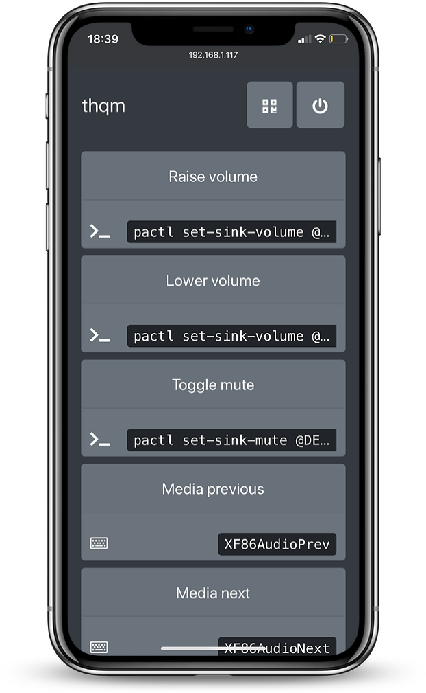

# thqm
> Control your desktop from your phone

 [](https://pypi.org/project/thqm/)

<p align="center">
 
</p>

`thqm` (pronounced tahakoom from the arabic تحكم  meaning control).

`thqm` starts a `waitress` WSGI server on the host machine and allows the client to run pre-configured commands
& hotkeys on the host machine. This allows for simple remote command & hotkey execution.

A few nice use cases are:
  * Media playback control
  * Volume control
  * Download/torrent control
  * Control other web applications e.g. Jupyter notebook server

# Installation
```shell
pip install thqm
```
`thqm` is compatible with linux & MacOS (maybe windows ?, though probably not the hotkeys).

# Dependencies

  * `python3`
  * `flask`
  * `pyqrcode`
  * `waitress`

For hotkey execution:
  * linux: `xdotool`
  * MacOS: `osascript`

# Usage

To start the `thqm` server, on the host machine, simply run:
```shell
thqm
```
The help:
```
usage: thqm [-h] [-c CONFIG] [-p PORT] [-q] [-v]

Remote command and hotkey execution server.

optional arguments:
  -h, --help            show this help message and exit
  -c CONFIG, --config CONFIG
                        Path to config file. (default:
                        /home/lcoyle/.config/thqm/config)
  -p PORT, --port PORT  Port number. (default: 8800)
  -q, --qrcode          Show the qrcode. (default: False)
  -v, --verbosity       Verbosity of the waitress server. -v will print
                        events. -vv will print server messages. (default: 0)
```

The `-q` flag will print a qr-code in the terminal, this qr-code will bypass the `thqm-auth` authentication, the same is true for the in browser qr-code, this makes it particularly easy to share access with others.
<p align="center">
 
</p>

# Configuration

`thqm` reads a configuration file located at `$XDG_CONFIG_HOME/thqm/config` (or `$HOME/.config/thqm/config` if `$XDG_CONFIG_HOME` is not defined). This `ini` format file contains the pre-configured commands & hotkeys.

Each `ini` block can have the following structure:
```ini
[event name]        # name of the event
exec_cmd=...        # command to execute
exec_hotkey=...     # hotkey to execute (on linux use xdotool key names, on macos use osascript key names)
icon_path=...       # (optional) icon of the the event
```
if the event has both an `exec_cmd` and an `exec_hotkey` the command is run prior to running the hotkey.

Here would be the contents for media playback and audio control:
```ini
# requires pactl
[Raise volume]
exec_cmd=pactl set-sink-volume @DEFAULT_SINK@ +10%

[Lower volume]
exec_cmd=pactl set-sink-volume @DEFAULT_SINK@ -10%

[Toggle mute]
exec_cmd=pactl set-sink-mute @DEFAULT_SINK@ toggle

# using media keys
[Media previous]
exec_hotkey=XF86AudioPrev

[Media next]
exec_hotkey=XF86AudioNext

[Media play]
exec_hotkey=XF86AudioPlay

[Media pause]
exec_hotkey=XF86AudioPause

# browser control
[play/pause]
exec_hotkey=space

[scrub back]
exec_hotkey=Left

[scrub forward]
exec_hotkey=Right
```

If you want rudimentary authentication, add the `thqm-auth` block, with the `password` key, **don't use a real password, the encryption isn't secure**:
```ini
[thqm-auth]
password=super_secret_password
```

